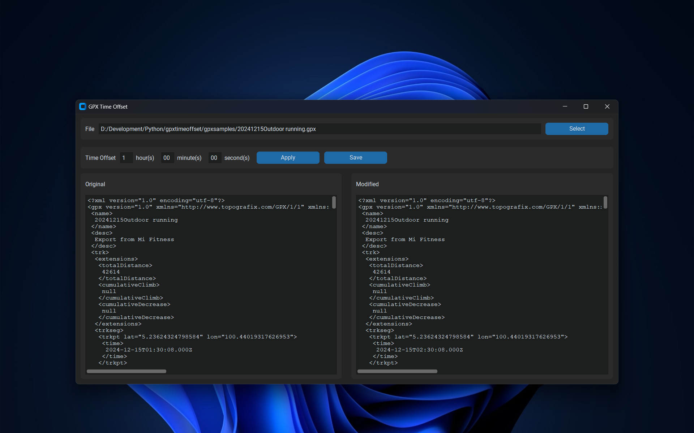

# GPX Time Offset
GPX Time Offset is a Python script that offsets every record in a GPX file by the same amount of time. It comes with a sleek UI that allows you to load a GPX file, offset the time as desired and save the modified file.



## Background
"But, why?" you ask.

This project started off to address a personal need. The budget wearable device that I use for tracking outdoor activities including running and riding has an erratic app. It has the uncanny habit of occasionally ignoring the time zone when exporting an activity.

This proves to be a frustration, but not enough for me to ditch the device. Not if I could do something about it. I decided I could write a script to rectify the GPX file. And so begins GPX Time Offset.

The executable file for the app can be found under `gpxtimeoffset/dist`. But I wouldn't want to run any unverified app downloaded off the internet. You shouldn't, either. Download the project and follow one of the two methods below to use the app.


## Running GPX Time Offset in a Virtual Environment
Python virtual environments are isolated spaces that allow you to manage project-specific dependencies without affecting your system's global Python installation. To do so, follow the steps below.

### Setting up Virtual Environment
1. [Install Python](https://www.python.org/downloads/)
2. Navigate to the root of the project.
3. Create a virtual environment (named `.venv`, for example):
```bash
python -m venv .venv
```
4. Activate the virtual environment:
```bash
".venv/Scripts/Activate"
```
5. Install the required packages:
```bash
pip install -r requirements.txt
```

### Running GPXTimeOffset
1. Navigate to the root directory of the project.
2. Activate virtual environment:
```bash
".venv/Scripts/Activate"
```
3. Run App.py:
```bash
python gpxtimeoffset/App.py
```

## Compiling GPXTimeOffset into an Executable
Alternatively, compile app into an executable for easier usage.

1. Install `pyinstaller`. This is not included in `requirements.txt` of the project.
```bash
pip install pyinstaller
```
2. Navigate to the root directory of the project.
3. Run the packaging command to generate the executable:
```bash
pyinstaller --onefile GUI/App.py
```
4. The executable can be found in the `dist` folder.